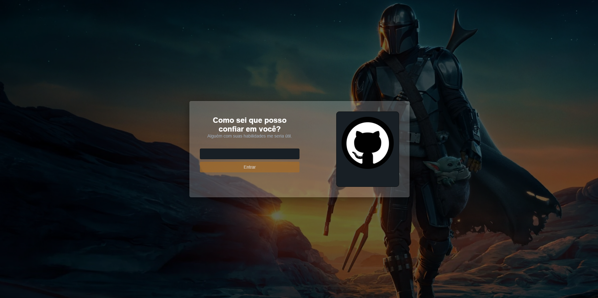

<p align='center'></p>
<h1 align='center'>Aluracord</h1>
<p align='center'>


</p>

# 🔖 Descrição
<p> 💬 Criação de um chat realtime na #ImersaoReact da Alura<p>

# 🚀 Tecnologias
Esse projeto está utilizando as seguintes tecnologias:
- HTML
- CSS
- JavaScript
- [NextJs](https://nextjs.org/)
- [Supabase](https://supabase.com/)


# 🎲 Como utilizar

## Clone esse repositório
```sh
git clone https://github.com/rafaasimi/aluracord-imersao-alura.git
```


## Navegue até o repositório do projeto
```sh
cd aluracord-imersao-alura
```


## Instale as dependências
```sh
yarn install
```

## Inicie o projeto
```sh
yarn dev
```

<h3>🖼 Layout</h3>



## 📝 Licença
<p>O projeto se encontra sob licença MIT. Para mais detalhes, acesse <a href='LICENSE'>license<a>.</p>

---
<p>Criado com 💙 por <a href='https://github.com/rafaasimi/' target='_blank'>Rafael Simionato</a></p>